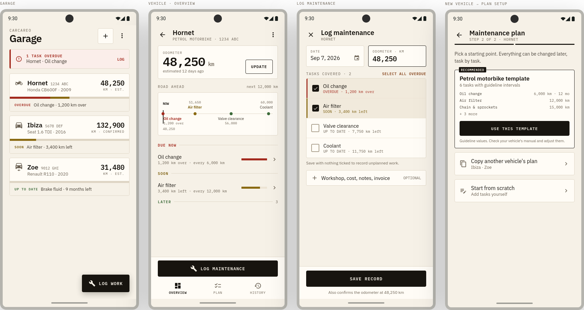
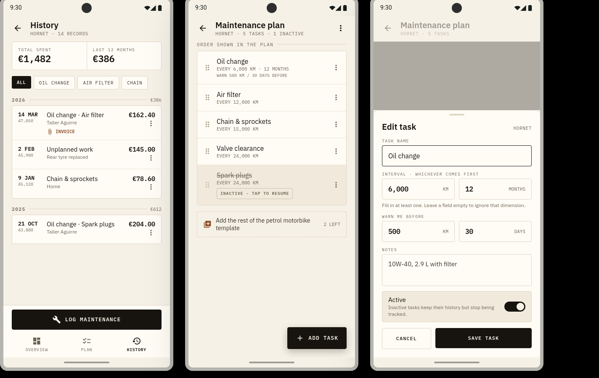

<div align="center">


# CarCareo

**Keep track of when your vehicles need servicing — without accounts, cloud, or clutter.**

`Android 8+` · `Kotlin + Jetpack Compose` · `100% offline` · `ES / EN`

</div>

---

CarCareo is a small Android app for the maintenance of your **personal fleet** —
a motorbike, the family car, an EV. You tell it what each vehicle is, give it a
maintenance plan (from a template or your own), and log work as you do it. The
app works out what is **overdue**, what is **coming up**, and roughly **how many
kilometres** each vehicle has on it today.

Everything lives on the phone. There is no sign-up, no server, no analytics, and
no network permission. Your data moves between devices as a single JSON file that
you export and import yourself.

> **Why it exists:** the app is only useful if you still keep it up to date two
> years from now. Every screen is built so that logging an intervention or
> confirming the odometer takes seconds.

---

## Screenshots

Garage · vehicle overview · logging an intervention · plan setup



History & costs · plan editor · task editor



---

## How it works

**1 · Add a vehicle.** Pick a type (petrol motorbike, petrol car, electric car),
name it, and enter the current odometer reading. Make, model, year and plate are
optional. A yearly-km estimate (10 000 km for cars, 8 000 for motorbikes by
default) lets the app project the odometer forward between readings.

**2 · Give it a plan.** Each vehicle has its own list of maintenance tasks, each
with a **km interval, a time interval, or both** (whichever comes first). Start
from the built-in template for that vehicle type, copy another vehicle's plan, or
add tasks by hand. Tasks can be made *inactive* — they keep their history but
stop being tracked.

**3 · Log work.** One screen records an intervention: it is pre-filled with
today's date and the current odometer, and the overdue / upcoming tasks are
pre-checked. Add a workshop, cost, notes and an invoice attachment if you want.
Saving also confirms the odometer. Unplanned work (not tied to any plan task) is
fine.

**4 · Read the status.** Task state — *overdue*, *coming up*, *up to date* — is
**never stored**. It is recalculated every time from your logged records and the
estimated odometer, so it is always correct. The garage shows a per-vehicle
traffic light and a one-line summary; the vehicle screen shows a "road ahead"
timeline of what is due within the next service window.

**5 · Keep it portable.** *Settings → Export a backup* writes every vehicle,
plan and record to one JSON file. Import it on another device to replace or merge.

---

## Features

| Area | What you get |
|---|---|
| **Garage** | Several vehicles at a glance, each with a status light and next-task summary. Archive vehicles you no longer own without losing their history. |
| **Odometer** | Quick "update km", forward estimation between readings, and a guard against accidental large rollbacks. |
| **Maintenance plan** | Per-vehicle tasks with km / month intervals and an optional "warn me X km / days before". Built-in templates per vehicle type; duplicate or start empty. |
| **Computed status** | Overdue / upcoming / OK derived from records + odometer, never persisted. |
| **Logging** | One-screen interventions, pre-filled and pre-checked. Free-form records allowed. Optional cost, workshop, notes, invoice file. |
| **History & costs** | Timeline per vehicle, filter by task, total and last-12-months spend. |
| **Reminders** | Optional weekly maintenance check (one notification per vehicle) and a monthly odometer nudge. Both off by default. |
| **Backup** | Full export / import as a single JSON file (replace or merge). |
| **Bilingual** | Spanish / English, following the device language. Units: km and months. |

---

## Tech stack

- **Kotlin**, **Jetpack Compose** (Material 3), Navigation Compose
- **Room** for local storage, **kotlinx.serialization** for backups
- **WorkManager** for the optional reminders
- Manual DI (`di/AppContainer` + `ui/AppViewModelProvider`) — no Hilt/Dagger
- A **pure, unit-tested domain layer** (`domain/`): the maintenance-calculation
  engine has no Android dependencies and is the part with real test coverage

`minSdk 26 · targetSdk 37 · applicationId com.xabier.carcareo`

## Project layout

```
app/src/main/java/com/xabier/carcareo/
  data/           Room entities, DAOs, repositories, backup codec, prefs
  domain/         pure calculation engine, odometer estimator, templates, rules
  di/             manual dependency container
  notifications/  WorkManager workers, alert dedup
  ui/             Compose screens, view models, theme, navigation
```

## Build

No Gradle on `PATH` — use the wrapper, with `JAVA_HOME` pointed at Android
Studio's bundled JBR:

```bash
export JAVA_HOME=/path/to/android-studio/jbr
export ANDROID_HOME=$HOME/Android/Sdk

./gradlew :app:assembleDebug --console=plain
```

Checks:

```bash
./gradlew :app:testDebugUnitTest   # domain unit tests
./gradlew :app:lintDebug           # lint — HardcodedText is promoted to an error
```

The instrumented backup round-trip test (`BackupRoundTripTest`) needs a device or
emulator and is run from Android Studio.

## Design notes

- The UI is a "workshop ledger": warm paper background, hairline rules, mono
  type for anything numeric, status shown as a labelled stripe, one dark bar per
  screen for the primary action.
- **`plan-app-mantenimiento-vehiculos.md` (section 2) is the source of truth for
  behaviour** and its decisions are fixed.
- Task state is computed, never persisted.
- Local-only by design: `allowBackup=false`, no cloud sync. The database
  currently ships without a Room migration path, so the first schema change will
  need one.
